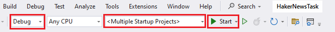
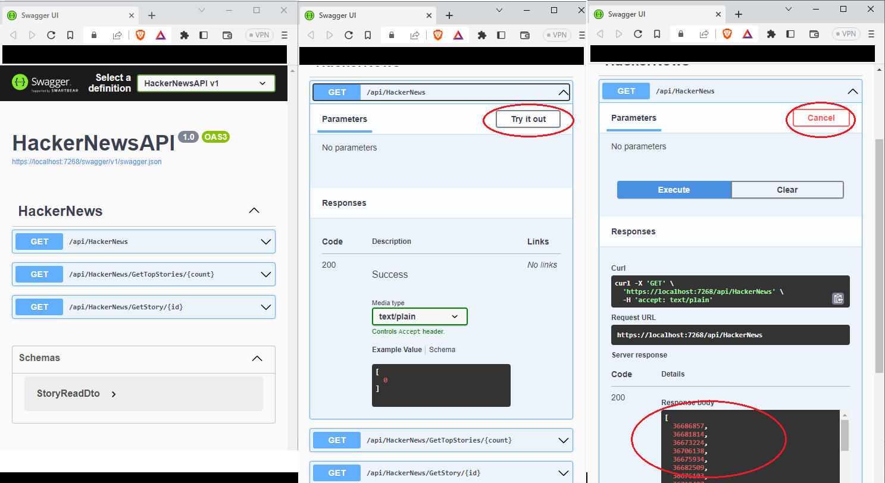
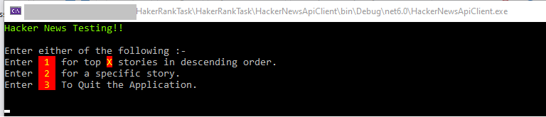
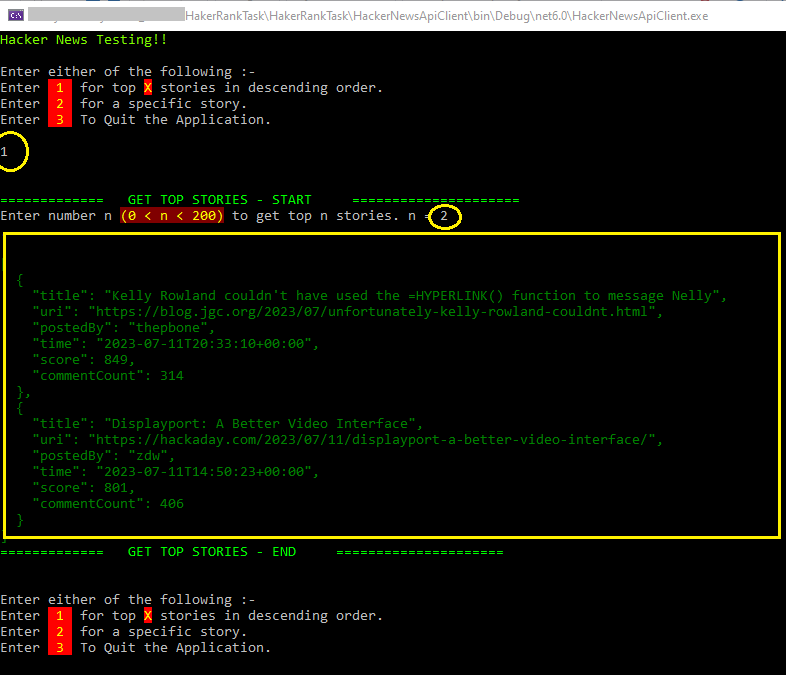
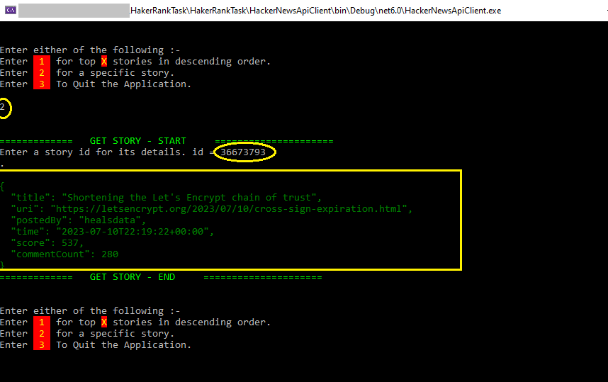
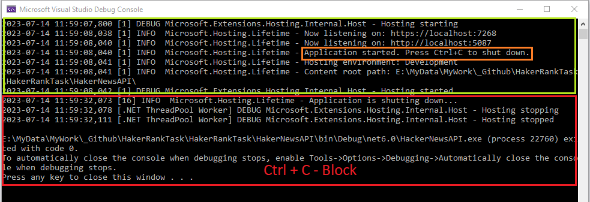

# Hacker News Task

## How to Run

Download the complete solution to your machine and Open it in VS2022.
Update the Nuget packages and build.
Right click on the solution **HakerNewsTask** and select **Properties**.
Configure the items as shown in the figure and click Ok.

Run the solution by running Ctrl + F5 or from the start button .

This will start the Web project at **https://localhost:7268** opening **swagger page in browser**, a **console log of web project** and a **console for Testing**.

Development can be tested by both Swagger and via the Console Utility.

### API

There RESTful methods

1. Get - This returns all the TopSotries Id's _This was not in the document, it is required internally. This can be used to to get an Id for GetStory call._.
1. GetTopStories(int count) - This will return the top **count** items in descending order of their score.
1. GetStory(int id) - Returns the Json formatted string for requested Id.

### Assumptions

- There are few stories having same score. I have taken the first in the list for displaying in top n.
  \_ If there are 3 stories for score 870, then the stories are added to a list, and I am simply taking the first item.
- CommentCount is mapped to Decendants.

### Swagger

Using Swagger is simple.

- Click on interested operation
- Click on **Try it out** button.
  - This will change the button to **Cancel**
  - Show an **Execute** button.
  - Enter value if asked.
- Click **Execute**.
- On Success data will be displayed under **Responses**.
- In case of Failure, error will be displayed under **Responses**.

### Console

- The console is configured to talk to Web project at **https://localhost:7268**. Any changes to the URL will be required an update and rebuild of client.
- Console will ask to execute
  - **1** for top **X** stories in descending order.
  - **2** for a specific story data
  - **3** to Quit.
- Following images shows sample input and output.

- 

- 

### Logs

- Logging happens in the console that is launched when Solution is run.
- Logging also is done to a file in **C:\temp\HackerNewsApiLogs**

## Stopping
- Hit **Ctrl + C** in the console with logging - which hosts the application.
- This will close the Broswer as well as the testing client (Console)
- 

# Enhancements

- Loading the cache when server loads.
  - Currently the cache is loaded on the first request.
  - A timer then keeps the cache udpated **CONTINUOUSLY** post 1 second sleep **_(NOT CONFIGURABLE)_**.
- Memory Profile the solution and optimize it for memory and performance.
- Make changing text configurable.
- More test cases
- Benchmarking methods.
- Better Naming conventions

# Working Salient Points

- Internal cache
  - Cache is built on first request.
  - The cache then is updated on a timer.
  - All subsequent calls for **TOP n stories** are then returned from the cache.
- AutoMapper is used to convert data from source to data required with required formatting - DTO
- Request for individual stories for each id in the Top stories are executed in parallel.
- Logs contains tokens **PERF** which provides information on methods performance. 
- Known Disadvantage
  - Request made for TOP n stories during building of cache will receive stale data.
